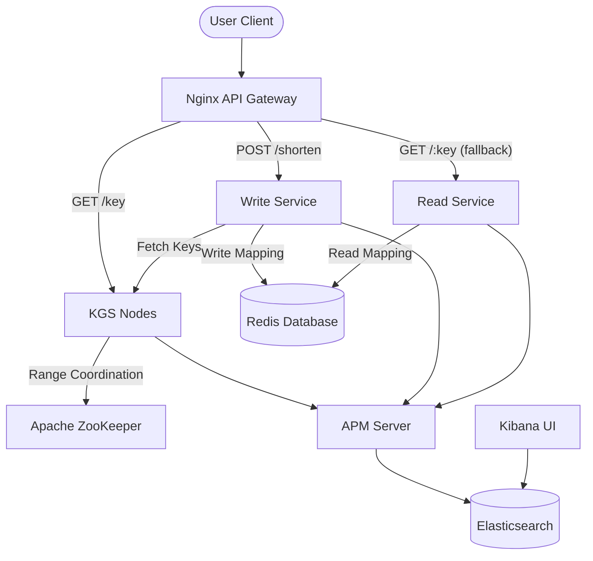

# TinyURL - Distributed URL Shortening System

This repository contains a highly scalable, distributed URL Shortening service built with Golang. It consists of three primary services:
1. **Key Generation Service (KGS)**: Generates unique, collision-free short URL keys (Base62 strings) using Apache ZooKeeper.
2. **Write Service (`write-service`)**: Fetches keys from KGS, stores key-to-URL mappings in Redis, and returns the shortened link.
3. **Read Service (`read-service`)**: Exposes short URL keys, resolves them in Redis, and redirects users to the original destination.

The system is designed to handle extreme concurrency and includes end-to-end performance optimizations and distributed tracing.

## Architecture Overview



*   **Language**: Golang
*   **Coordination**: Apache ZooKeeper
*   **Storage**: Redis (Persistent Key-Value Store)
*   **Load Balancing**: Nginx API Gateway
*   **Observability**: Elastic Stack (Elasticsearch, Kibana, APM Server)
*   **Containerization**: Docker & Docker Compose

### 1. Key Generation Strategy
To ensure absolutely no key collisions across horizontally scaled instances, the KGS uses **Apache ZooKeeper**. 
Instead of hitting ZooKeeper for every single key request, each KGS instance claims a large, mutually exclusive "block" or "range" of keys at a time. The instance dispenses these keys from local memory. Once an instance exhausts its range, it goes back to ZooKeeper to fetch a new block.

### 2. URL Shortening (Write Service)
The `write-service` exposes a `POST /shorten` endpoint. When called:
1. It requests a new unique key from the KGS cluster directly.
2. It saves the key and long URL as a key-value pair in Redis.
3. It returns the shortened URL: `http://localhost:8080/<key>`.

### 3. URL Redirection (Read Service)
The `read-service` acts as a wildcard handler at the root path (`/`). When called with a short key:
1. It extracts the key from the path.
2. It queries Redis for the associated original URL.
3. If found, it redirects the client with an HTTP `302 Found` status. If not, it returns `404 Not Found`.

---

## Load Testing & Performance Tuning (Target: 1M TPM)

We conducted stress testing using Apache Bench (`ab`) running concurrently across 12 terminal windows. Our goal was to achieve **1,000,000 Transactions Per Minute (TPM)**, roughly **16,666 Requests Per Second (RPS)**.

Major bottlenecks resolved:
*   **ZooKeeper Network IO**: Solved by setting `rangeSize` to `100,000`. KGS only calls ZooKeeper once every ~6 seconds at 16K RPS.
*   **Nginx Connection Limits**: Increased `worker_connections` from 1024 to 10240.
*   **TCP Handshake Overhead**: Configured keepalive upstreams (`keepalive 500`) and configured HTTP 1.1 keep-alives in Nginx proxying rules.
*   **APM Sampling**: Aggressively sampled APM traces under high load to prevent Elasticsearch CPU and disk bottlenecks.

---

## How to Run

1.  **Start the Cluster** (with 3 KGS nodes):
    ```bash
    docker-compose up -d --build --scale kgs=3
    ```

2.  **Shorten a URL**:
    ```bash
    curl -X POST -H "Content-Type: application/json" -d '{"url":"https://google.com"}' http://localhost:8080/shorten
    ```
    *Expected output*: `{"tiny_url":"http://localhost:8080/0"}`

3.  **Resolve / Redirect a URL**:
    ```bash
    curl -i http://localhost:8080/0
    ```
    *Expected output*: `HTTP/1.1 302 Found` with `Location: https://google.com`.

4.  **View Traces in Kibana**:
    Open `http://localhost:5601` -> Observability -> APM to view end-to-end distributed traces crossing `nginx` $\rightarrow$ `write-service` $\rightarrow$ `kgs`.

5.  **Stop the Cluster**:
    ```bash
    docker-compose down
    ```
